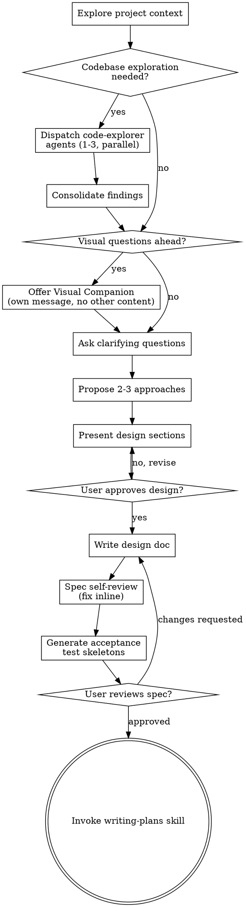

# Brainstorming Ideas Into Designs

Help turn ideas into fully formed designs and specs through natural collaborative dialogue.

Start by understanding the current project context, then ask questions one at a time to refine the idea. Once you understand what you're building, present the design and get user approval.

<HARD-GATE>
Do NOT invoke any implementation skill, write any code, scaffold any project, or take any implementation action until you have presented a design and the user has approved it. This applies to EVERY project regardless of perceived simplicity.
</HARD-GATE>

## Anti-Pattern: "This Is Too Simple To Need A Design"

Every project goes through this process. A todo list, a single-function utility, a config change — all of them. "Simple" projects are where unexamined assumptions cause the most wasted work. The design can be short (a few sentences for truly simple projects), but you MUST present it and get approval.

## Core Behaviors

### Surface Assumptions

Before designing anything non-trivial, explicitly state your assumptions:

```
ASSUMPTIONS I'M MAKING:
1. [assumption about requirements]
2. [assumption about architecture]
3. [assumption about scope]
→ Correct me now or I'll proceed with these.
```

Don't silently fill in ambiguous requirements. The most common failure mode is making wrong assumptions and running with them unchecked.

### Manage Confusion Actively

When you encounter inconsistencies, conflicting requirements, or unclear specifications:

1. **STOP.** Do not proceed with a guess.
2. Name the specific confusion.
3. Present the tradeoff or ask the clarifying question.
4. Wait for resolution before continuing.

## Checklist

You MUST create a task for each of these items and complete them in order:

1. **Explore project context** — check files, docs, recent commits. Assess whether dispatching `code-explorer` agents would help (see Structured Codebase Exploration below).
2. **Offer visual companion** (if topic will involve visual questions) — this is its own message, not combined with a clarifying question. See the Visual Companion section below.
3. **Ask clarifying questions** — one at a time, understand purpose/constraints/success criteria
4. **Propose 2-3 approaches** — with trade-offs and your recommendation
5. **Present design** — in sections scaled to their complexity, get user approval after each section
6. **Write design doc** — gather context from the conversation (all approved decisions, constraints, success criteria, approaches considered, existing patterns), then **delegate to sonnet subagent** using `skills/brainstorming/spec-writer-prompt.md`. Review subagent output before proceeding: does it match design decisions? Any placeholders? All success criteria present?
7. **Spec self-review** — **delegate to sonnet subagent** using `skills/brainstorming/spec-reviewer-prompt.md`. Read reviewer output. Patch minor issues inline. Note design questions for the user review gate.
8. **Generate acceptance test skeletons** — extract success criteria from the spec and write test outlines (see below)
9. **User reviews written spec** — ask user to review the spec file before proceeding
10. **Transition to implementation** — invoke writing-plans skill to create implementation plan

## Process Flow



**The terminal state is invoking writing-plans.** Do NOT invoke frontend-design, mcp-builder, or any other implementation skill. The ONLY skill you invoke after brainstorming is writing-plans.

## The Process

**Understanding the idea:**

- Check out the current project state first (files, docs, recent commits)

**Structured Codebase Exploration:**

After your initial context check, assess whether dispatching `code-explorer` agents would meaningfully help the current request. This is a judgment call, not a mandatory step.

**When to dispatch explorers:**
- Working in an existing codebase with unfamiliar patterns
- Feature that needs to integrate with existing code paths
- User's request touches multiple subsystems you haven't traced

**When to skip:**
- Greenfield project or standalone addition
- Simple config, documentation, or prompt-only change
- You already understand the relevant codebase areas

**How to dispatch:**
- Decide what aspects need exploration based on the user's request
- Craft a focused prompt for each explorer (e.g., "trace how the skill-loading pipeline works from session-start hook to skill resolution" or "map the agent dispatch patterns used in subagent-driven-development")
- Dispatch 1-3 `code-explorer` agents in parallel using the Agent tool with `subagent_type: "super-agent-skills:code-explorer"`
- Max 3 explorers — more creates consolidation overhead exceeding the benefit

**After explorers return:**
- Synthesize their findings into a codebase understanding summary
- Use this to inform your clarifying questions and approach proposals
- Do NOT blindly relay explorer output — extract what's relevant to the design task

- Before asking detailed questions, assess scope: if the request describes multiple independent subsystems (e.g., "build a platform with chat, file storage, billing, and analytics"), flag this immediately. Don't spend questions refining details of a project that needs to be decomposed first.
- If the project is too large for a single spec, help the user decompose into sub-projects: what are the independent pieces, how do they relate, what order should they be built? Then brainstorm the first sub-project through the normal design flow. Each sub-project gets its own spec → plan → implementation cycle.
- For appropriately-scoped projects, ask questions one at a time to refine the idea
- Prefer multiple choice questions when possible, but open-ended is fine too
- Only one question per message - if a topic needs more exploration, break it into multiple questions
- Focus on understanding: purpose, constraints, success criteria

**Divergent Exploration:**

After understanding the basics, generate 5-8 idea variations using these lenses:
- **Inversion:** "What if we did the opposite?"
- **Constraint removal:** "What if budget/time/tech weren't factors?"
- **Audience shift:** "What if this were for [different user]?"
- **Combination:** "What if we merged this with [adjacent idea]?"
- **Simplification:** "What's the version that's 10x simpler?"
- **10x version:** "What would this look like at massive scale?"

Push beyond what the user initially asked for. Don't generate 20+ shallow variations — 5-8 well-considered ones beat 20 shallow ones.

**Exploring approaches:**

- Propose 2-3 different approaches with trade-offs
- Present options conversationally with your recommendation and reasoning
- Lead with your recommended option and explain why

**Convergent Evaluation:**

For each approach, stress-test against three criteria:
- **User value:** Who benefits and how much? Is this a painkiller or a vitamin?
- **Feasibility:** What's the technical and resource cost? What's the hardest part?
- **Differentiation:** What makes this genuinely different?

**Surface hidden assumptions.** For each approach: what are you betting is true? What could kill it?

**Presenting the design:**

- Once you believe you understand what you're building, present the design
- Scale each section to its complexity: a few sentences if straightforward, up to 200-300 words if nuanced
- Ask after each section whether it looks right so far
- Cover: architecture, components, data flow, error handling, testing
- If the feature handles auth, user input, external APIs, payment, or PII, invoke `super-agent-skills:threat-modeling` to identify threats before finalizing the design. Append the threat model to the spec.
- Be ready to go back and clarify if something doesn't make sense

**Design for isolation:** Break into units with one purpose, well-defined interfaces, and independent testability. Smaller units are easier to reason about and edit reliably.

**Existing codebases:** Follow existing patterns. Include targeted improvements where existing code problems affect the work, but don't propose unrelated refactoring.

## After the Design

**Documentation:**

- Write the validated design (spec) to `docs/super-agent-skills/specs/YYYY-MM-DD-<topic>-design.md`
  - (User preferences for spec location override this default)
- Use elements-of-style:writing-clearly-and-concisely skill if available
- Commit the design document to git

**Spec Document Structure:**

The spec should cover these areas (scaled to project complexity):

1. **Objective** — What we're building and why. Success criteria.
2. **Tech Stack** — Framework, language, key dependencies
3. **Project Structure** — Where source code lives, where tests go
4. **Code Style** — Real code snippet showing conventions
5. **Testing Strategy** — Framework, locations, coverage expectations
6. **Boundaries** — Three tiers:
   - Always do: run tests before commits, validate inputs
   - Ask first: database schema changes, adding dependencies
   - Never do: commit secrets, remove failing tests without approval

**Spec Self-Review:**
After writing the spec document, dispatch a spec-reviewer subagent using `skills/brainstorming/spec-reviewer-prompt.md` with the spec path.

Read the reviewer's output. For each concern:
- If it's a clear gap (missing section, internal contradiction): patch it inline using the Write tool.
- If it requires a design decision: note it for the user review gate.

Do not re-dispatch the reviewer after patching — proceed to the user review gate.

**Acceptance Test Generation:**

After the spec self-review passes, extract each success criterion and generate a test skeleton. Append these to the spec document as a new section:

```markdown
## Acceptance Tests

Generated from success criteria. These will be incorporated into the implementation plan as pre-defined test cases.

- [ ] `test: [success criterion rephrased as test name]`
      Given: [precondition]
      When: [action]
      Then: [expected outcome]

- [ ] `test: [next criterion]`
      Given: [precondition]
      When: [action]
      Then: [expected outcome]
```

**Rules:** One test per success criterion. Given/When/Then format. Specific inputs/outputs (not "should work correctly"). Include at least one negative test. These are skeletons — the implementer writes actual test code during TDD.

**Backlog Update:** Add the work item to `docs/super-agent-skills/backlogs.md` under "In Progress". Capture any unrelated ideas mentioned during brainstorming under "Ideas (Unprioritized)".

**User Review Gate:** Ask the user to review the written spec before proceeding. Wait for approval. If changes requested, patch and re-review.

**Implementation:** Invoke `super-agent-skills:writing-plans` to create the implementation plan. Do NOT invoke any other skill.

## Anti-Rationalizations

| Thought | Reality |
|---------|---------|
| "Requirements are obvious" | Unwritten requirements are unvalidated assumptions. Write them down. |
| "I'll figure out the details during implementation" | Details discovered during implementation are rework. Surface them now. |
| "The user knows what they want" | Even clear requests have implicit assumptions. The spec surfaces them. |

## Visual Companion

Browser-based companion for mockups, diagrams, and visual comparisons. Available as a tool — not a mode.

**Offering:** When upcoming questions involve visual content, offer once in its **own message** (no other content):
> "Some of what we're working on might be easier to show in a browser — mockups, diagrams, comparisons. This feature is token-intensive. Want to try it? (Requires opening a local URL)"

If they decline, proceed text-only. If they agree, read `skills/brainstorming/visual-companion.md` before proceeding.

**Per-question decision:** For each question, ask: **would the user understand this better by seeing it?** Use browser for visual content (mockups, wireframes, diagrams). Use terminal for text content (requirements, tradeoffs, scope decisions).
