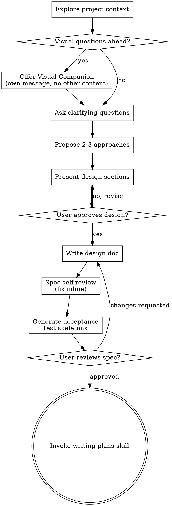

# Brainstorming Ideas Into Designs

Help turn ideas into fully formed designs and specs through natural collaborative dialogue.

Start by understanding the current project context, then ask questions one at a time to refine the idea. Once you understand what you're building, present the design and get user approval.

<HARD-GATE>
Do NOT invoke any implementation skill, write any code, scaffold any project, or take any implementation action until you have presented a design and the user has approved it. This applies to EVERY project regardless of perceived simplicity.
</HARD-GATE>

## Anti-Pattern: "This Is Too Simple To Need A Design"

Every project goes through this process. A todo list, a single-function utility, a config change — all of them. "Simple" projects are where unexamined assumptions cause the most wasted work. The design can be short (a few sentences for truly simple projects), but you MUST present it and get approval.

## Core Behaviors

### Surface Assumptions

Before designing anything non-trivial, explicitly state your assumptions:

```
ASSUMPTIONS I'M MAKING:
1. [assumption about requirements]
2. [assumption about architecture]
3. [assumption about scope]
→ Correct me now or I'll proceed with these.
```

Don't silently fill in ambiguous requirements. The most common failure mode is making wrong assumptions and running with them unchecked.

### Manage Confusion Actively

When you encounter inconsistencies, conflicting requirements, or unclear specifications:

1. **STOP.** Do not proceed with a guess.
2. Name the specific confusion.
3. Present the tradeoff or ask the clarifying question.
4. Wait for resolution before continuing.

## Checklist

You MUST create a task for each of these items and complete them in order:

1. **Explore project context** — check files, docs, recent commits
2. **Offer visual companion** (if topic will involve visual questions) — this is its own message, not combined with a clarifying question. See the Visual Companion section below.
3. **Ask clarifying questions** — one at a time, understand purpose/constraints/success criteria
4. **Propose 2-3 approaches** — with trade-offs and your recommendation
5. **Present design** — in sections scaled to their complexity, get user approval after each section
6. **Write design doc** — gather context from the conversation (all approved decisions, constraints, success criteria, approaches considered, existing patterns), then **delegate to sonnet subagent** using `skills/brainstorming/spec-writer-prompt.md`. Review subagent output before proceeding: does it match design decisions? Any placeholders? All success criteria present?
7. **Spec self-review** — **delegate to sonnet subagent** using `skills/brainstorming/spec-reviewer-prompt.md`. Read reviewer output. Patch minor issues inline. Note design questions for the user review gate.
8. **Generate acceptance test skeletons** — extract success criteria from the spec and write test outlines (see below)
9. **User reviews written spec** — ask user to review the spec file before proceeding
10. **Transition to implementation** — invoke writing-plans skill to create implementation plan

## Process Flow



**The terminal state is invoking writing-plans.** Do NOT invoke frontend-design, mcp-builder, or any other implementation skill. The ONLY skill you invoke after brainstorming is writing-plans.

## The Process

**Understanding the idea:**

- Check out the current project state first (files, docs, recent commits)
- Before asking detailed questions, assess scope: if the request describes multiple independent subsystems (e.g., "build a platform with chat, file storage, billing, and analytics"), flag this immediately. Don't spend questions refining details of a project that needs to be decomposed first.
- If the project is too large for a single spec, help the user decompose into sub-projects: what are the independent pieces, how do they relate, what order should they be built? Then brainstorm the first sub-project through the normal design flow. Each sub-project gets its own spec → plan → implementation cycle.
- For appropriately-scoped projects, ask questions one at a time to refine the idea
- Prefer multiple choice questions when possible, but open-ended is fine too
- Only one question per message - if a topic needs more exploration, break it into multiple questions
- Focus on understanding: purpose, constraints, success criteria

**Divergent Exploration:**

After understanding the basics, generate 5-8 idea variations using these lenses:
- **Inversion:** "What if we did the opposite?"
- **Constraint removal:** "What if budget/time/tech weren't factors?"
- **Audience shift:** "What if this were for [different user]?"
- **Combination:** "What if we merged this with [adjacent idea]?"
- **Simplification:** "What's the version that's 10x simpler?"
- **10x version:** "What would this look like at massive scale?"

Push beyond what the user initially asked for. Don't generate 20+ shallow variations — 5-8 well-considered ones beat 20 shallow ones.

**Exploring approaches:**

- Propose 2-3 different approaches with trade-offs
- Present options conversationally with your recommendation and reasoning
- Lead with your recommended option and explain why

**Convergent Evaluation:**

For each approach, stress-test against three criteria:
- **User value:** Who benefits and how much? Is this a painkiller or a vitamin?
- **Feasibility:** What's the technical and resource cost? What's the hardest part?
- **Differentiation:** What makes this genuinely different?

**Surface hidden assumptions.** For each approach, explicitly name:
- What you're betting is true (but haven't validated)
- What could kill this approach
- What you're choosing to ignore (and why that's okay for now)

**Presenting the design:**

- Once you believe you understand what you're building, present the design
- Scale each section to its complexity: a few sentences if straightforward, up to 200-300 words if nuanced
- Ask after each section whether it looks right so far
- Cover: architecture, components, data flow, error handling, testing
- If the feature handles auth, user input, external APIs, payment, or PII, invoke `super-agent-skills:threat-modeling` to identify threats before finalizing the design. Append the threat model to the spec.
- Be ready to go back and clarify if something doesn't make sense

**Design for isolation and clarity:**

- Break the system into smaller units that each have one clear purpose, communicate through well-defined interfaces, and can be understood and tested independently
- For each unit, you should be able to answer: what does it do, how do you use it, and what does it depend on?
- Can someone understand what a unit does without reading its internals? Can you change the internals without breaking consumers? If not, the boundaries need work.
- Smaller, well-bounded units are also easier for you to work with - you reason better about code you can hold in context at once, and your edits are more reliable when files are focused. When a file grows large, that's often a signal that it's doing too much.

**Working in existing codebases:**

- Explore the current structure before proposing changes. Follow existing patterns.
- Where existing code has problems that affect the work (e.g., a file that's grown too large, unclear boundaries, tangled responsibilities), include targeted improvements as part of the design - the way a good developer improves code they're working in.
- Don't propose unrelated refactoring. Stay focused on what serves the current goal.

## After the Design

**Documentation:**

- Write the validated design (spec) to `docs/super-agent-skills/specs/YYYY-MM-DD-<topic>-design.md`
  - (User preferences for spec location override this default)
- Use elements-of-style:writing-clearly-and-concisely skill if available
- Commit the design document to git

**Spec Document Structure:**

The spec should cover these areas (scaled to project complexity):

1. **Objective** — What we're building and why. Success criteria.
2. **Tech Stack** — Framework, language, key dependencies
3. **Project Structure** — Where source code lives, where tests go
4. **Code Style** — Real code snippet showing conventions
5. **Testing Strategy** — Framework, locations, coverage expectations
6. **Boundaries** — Three tiers:
   - Always do: run tests before commits, validate inputs
   - Ask first: database schema changes, adding dependencies
   - Never do: commit secrets, remove failing tests without approval

**Spec Self-Review:**
After writing the spec document, dispatch a spec-reviewer subagent using `skills/brainstorming/spec-reviewer-prompt.md` with the spec path.

Read the reviewer's output. For each concern:
- If it's a clear gap (missing section, internal contradiction): patch it inline using the Write tool.
- If it requires a design decision: note it for the user review gate.

Do not re-dispatch the reviewer after patching — proceed to the user review gate.

**Acceptance Test Generation:**

After the spec self-review passes, extract each success criterion and generate a test skeleton. Append these to the spec document as a new section:

```markdown
## Acceptance Tests

Generated from success criteria. These will be incorporated into the implementation plan as pre-defined test cases.

- [ ] `test: [success criterion rephrased as test name]`
      Given: [precondition]
      When: [action]
      Then: [expected outcome]

- [ ] `test: [next criterion]`
      Given: [precondition]
      When: [action]
      Then: [expected outcome]
```

**Rules for test skeletons:**
- One test per success criterion — no more, no less
- Use Given/When/Then format (readable by anyone, framework-agnostic)
- Be specific about inputs and expected outputs (not "should work correctly")
- Include at least one negative test (what should NOT happen)
- These are skeletons, not implementations — the implementer writes the actual test code during TDD

This bridges the gap between "what we want" (spec) and "how we prove it works" (tests). The implementer doesn't invent test cases from scratch — they implement pre-defined acceptance criteria.

**Backlog Update:**
After writing the spec, add the work item to `docs/super-agent-skills/backlogs.md` under "In Progress":
> "Added '[item name]' to the backlog under In Progress. Spec at `docs/super-agent-skills/specs/[path]`."

If the user mentions a parallel idea during brainstorming (something unrelated to the current task), capture it in the backlog under "Ideas (Unprioritized)" so it doesn't get lost:
> "Captured '[idea]' in the backlog Ideas section for later."

**User Review Gate:**
After the spec review loop passes, ask the user to review the written spec before proceeding:

> "Spec written and committed to `<path>`. Please review it and let me know if you want to make any changes before we start writing out the implementation plan."

Wait for the user's response. If they request changes, make them and re-run the spec review loop. Only proceed once the user approves.

**Implementation:**

- Invoke the super-agent-skills:writing-plans skill to create a detailed implementation plan
- Do NOT invoke any other skill. writing-plans is the next step.

## Key Principles

- **One question at a time** - Don't overwhelm with multiple questions
- **Multiple choice preferred** - Easier to answer than open-ended when possible
- **YAGNI ruthlessly** - Remove unnecessary features from all designs
- **Explore alternatives** - Always propose 2-3 approaches before settling
- **Incremental validation** - Present design, get approval before moving on
- **Be flexible** - Go back and clarify when something doesn't make sense

## Anti-Rationalizations

| Thought | Reality |
|---------|---------|
| "Requirements are obvious" | Unwritten requirements are unvalidated assumptions. Write them down. |
| "This is too simple to need a design" | Simple projects are where unexamined assumptions cause the most wasted work. The design can be short, but it must exist. |
| "I'll figure out the details during implementation" | Details discovered during implementation are rework waiting to happen. Surface them now. |
| "The user knows what they want" | Even clear requests have implicit assumptions. The spec surfaces those assumptions. |
| "A spec will slow us down" | A 15-minute spec prevents hours of rework. |

## Visual Companion

A browser-based companion for showing mockups, diagrams, and visual options during brainstorming. Available as a tool — not a mode. Accepting the companion means it's available for questions that benefit from visual treatment; it does NOT mean every question goes through the browser.

**Offering the companion:** When you anticipate that upcoming questions will involve visual content (mockups, layouts, diagrams), offer it once for consent:
> "Some of what we're working on might be easier to explain if I can show it to you in a web browser. I can put together mockups, diagrams, comparisons, and other visuals as we go. This feature is still new and can be token-intensive. Want to try it? (Requires opening a local URL)"

**This offer MUST be its own message.** Do not combine it with clarifying questions, context summaries, or any other content. The message should contain ONLY the offer above and nothing else. Wait for the user's response before continuing. If they decline, proceed with text-only brainstorming.

**Per-question decision:** Even after the user accepts, decide FOR EACH QUESTION whether to use the browser or the terminal. The test: **would the user understand this better by seeing it than reading it?**

- **Use the browser** for content that IS visual — mockups, wireframes, layout comparisons, architecture diagrams, side-by-side visual designs
- **Use the terminal** for content that is text — requirements questions, conceptual choices, tradeoff lists, A/B/C/D text options, scope decisions

A question about a UI topic is not automatically a visual question. "What does personality mean in this context?" is a conceptual question — use the terminal. "Which wizard layout works better?" is a visual question — use the browser.

If they agree to the companion, read the detailed guide before proceeding:
`skills/brainstorming/visual-companion.md`
