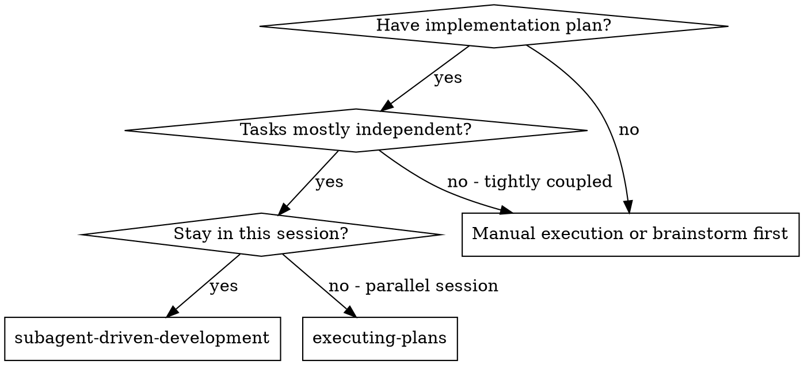
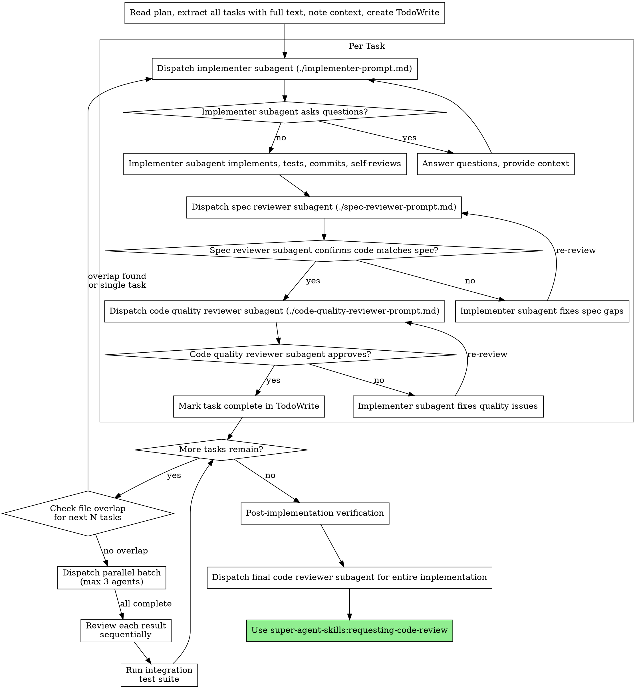

# Subagent-Driven Development

Execute plan by dispatching fresh subagent per task, with two-stage review after each: spec compliance review first, then code quality review.

**Why subagents:** You delegate tasks to specialized agents with isolated context. By precisely crafting their instructions and context, you ensure they stay focused and succeed at their task. They should never inherit your session's context or history — you construct exactly what they need. This also preserves your own context for coordination work.

**Core principle:** Fresh subagent per task + two-stage review (spec then quality) = high quality, fast iteration

## When to Use



**vs. Executing Plans (parallel session):**
- Same session (no context switch)
- Fresh subagent per task (no context pollution)
- Two-stage review after each task: spec compliance first, then code quality
- Faster iteration (no human-in-loop between tasks)

## The Process



**Chain completion:** After requesting-code-review approves the implementation, it will prompt the user with completion options: wrap up (lightweight checkpoint), ship it (merge/PR), or keep going. Do NOT commit or push directly — the chain handles it.

## Model Selection

Use the least powerful model that can handle each role to conserve cost and increase speed.

**Mechanical implementation tasks** (isolated functions, clear specs, 1-2 files): use a fast, cheap model. Most implementation tasks are mechanical when the plan is well-specified.

**Integration and judgment tasks** (multi-file coordination, pattern matching, debugging): use a standard model.

**Architecture, design, and review tasks**: use the most capable available model.

**Task complexity signals:**
- Touches 1-2 files with a complete spec → cheap model
- Touches multiple files with integration concerns → standard model
- Requires design judgment or broad codebase understanding → most capable model

## Handling Implementer Status

Implementer subagents report one of four statuses. Handle each appropriately:

**DONE:** Proceed to spec compliance review.

**DONE_WITH_CONCERNS:** The implementer completed the work but flagged doubts. Read the concerns before proceeding. If the concerns are about correctness or scope, address them before review. If they're observations (e.g., "this file is getting large"), note them and proceed to review.

**NEEDS_CONTEXT:** The implementer needs information that wasn't provided. Provide the missing context and re-dispatch.

**BLOCKED:** The implementer cannot complete the task. Assess the blocker:
1. If it's a context problem, provide more context and re-dispatch with the same model
2. If the task requires more reasoning, re-dispatch with a more capable model
3. If the task is too large, break it into smaller pieces
4. If the plan itself is wrong, escalate to the human

**Never** ignore an escalation or force the same model to retry without changes. If the implementer said it's stuck, something needs to change.

## Implementer Dispatch

**Implementer Instructions (include in every dispatch):**

In addition to the task text and context, instruct the implementer to:
- Build in thin vertical slices: implement one piece, test it, verify it, then expand
- Follow the increment cycle: Implement → Test → Verify → Commit → Next slice
- Do NOT implement the entire task in one pass
- Each increment must leave the system in a working, compilable state
- Touch only what the task requires (scope discipline)
- If a file grows beyond plan's intent, report as DONE_WITH_CONCERNS

Reference: The implementer should follow `super-agent-skills:incremental-implementation` and `super-agent-skills:test-driven-development` skills.

**Domain skills auto-trigger based on task context:**
- Designing APIs, endpoints, or module boundaries → invoke `super-agent-skills:api-and-interface-design`
- Building or modifying UI → invoke `super-agent-skills:frontend-ui-engineering`
- Handling user input, auth, or external data → invoke `super-agent-skills:security-and-hardening`
- Performance requirements or regressions → invoke `super-agent-skills:performance-optimization`
- Using frameworks/libraries → invoke `super-agent-skills:source-driven-development`
- Making architectural decisions → invoke `super-agent-skills:documentation-and-adrs`
- Browser-based debugging needed → invoke `super-agent-skills:browser-testing-with-devtools`

## Parallel Dispatch

When the plan contains independent tasks (no shared files), dispatch them simultaneously for faster execution.

### File Overlap Check

Before dispatching the next batch of tasks, check for file overlap:

1. Read the "Files" section of each upcoming task
2. Build a set of all files each task will touch (create + modify + test)
3. If any two tasks share ANY file → those tasks must stay sequential
4. Tasks with zero overlap can be dispatched in parallel

```
Task 3: Files: src/api/tasks.ts, tests/api/tasks.test.ts
Task 4: Files: src/components/TaskList.tsx, tests/components/TaskList.test.tsx
Task 5: Files: src/api/tasks.ts, src/api/auth.ts

→ Task 3 and Task 4: zero overlap → PARALLEL
→ Task 5 shares src/api/tasks.ts with Task 3 → SEQUENTIAL (after Task 3)
```

### Parallel Batch Execution

1. Group overlap-free tasks into a batch (max 3 agents)
2. Dispatch all agents in the batch simultaneously using background mode
3. Wait for all to complete
4. Run spec compliance review on each result (sequentially — reviewer needs to see combined state)
5. Run code quality review on each result
6. Fix issues sequentially (fixes may now touch shared areas)
7. Run full test suite after the batch to catch integration issues

### Safety Rules

- **Max 3 parallel agents** — more creates coordination overhead that exceeds the speed benefit
- **ANY shared file → sequential** — no exceptions, even if the changes are in different functions
- **BLOCKED/NEEDS_CONTEXT in batch → pause all** — resolve the blocker before continuing
- **Post-batch test suite is mandatory** — parallel work may have integration issues that per-task tests miss
- **When in doubt, stay sequential** — parallel dispatch is an optimization, not a requirement

For detailed algorithm and examples, see `parallel-dispatch-guide.md`.

## Prompt Templates

- `./implementer-prompt.md` - Dispatch implementer subagent
- `./spec-reviewer-prompt.md` - Dispatch spec compliance reviewer subagent
- `./code-quality-reviewer-prompt.md` - Dispatch code quality reviewer subagent

## Example Workflow

```
You: I'm using Subagent-Driven Development to execute this plan.

[Read plan file once: docs/plans/feature-plan.md]
[Extract all 5 tasks with full text and context]
[Create TodoWrite with all tasks]

Task 1: Hook installation script

[Get Task 1 text and context (already extracted)]
[Dispatch implementation subagent with full task text + context]

Implementer: "Before I begin - should the hook be installed at user or system level?"

You: "User level (~/.config/super-agent-skills/hooks/)"

Implementer: "Got it. Implementing now..."
[Later] Implementer:
  - Implemented install-hook command
  - Added tests, 5/5 passing
  - Self-review: Found I missed --force flag, added it
  - Committed

[Dispatch spec compliance reviewer]
Spec reviewer: ✅ Spec compliant - all requirements met, nothing extra

[Get git SHAs, dispatch code quality reviewer]
Code reviewer: Strengths: Good test coverage, clean. Issues: None. Approved.

[Mark Task 1 complete]

Task 2: Recovery modes

[Get Task 2 text and context (already extracted)]
[Dispatch implementation subagent with full task text + context]

Implementer: [No questions, proceeds]
Implementer:
  - Added verify/repair modes
  - 8/8 tests passing
  - Self-review: All good
  - Committed

[Dispatch spec compliance reviewer]
Spec reviewer: ❌ Issues:
  - Missing: Progress reporting (spec says "report every 100 items")
  - Extra: Added --json flag (not requested)

[Implementer fixes issues]
Implementer: Removed --json flag, added progress reporting

[Spec reviewer reviews again]
Spec reviewer: ✅ Spec compliant now

[Dispatch code quality reviewer]
Code reviewer: Strengths: Solid. Issues (Important): Magic number (100)

[Implementer fixes]
Implementer: Extracted PROGRESS_INTERVAL constant

[Code reviewer reviews again]
Code reviewer: ✅ Approved

[Mark Task 2 complete]

...

[After all tasks]
[Post-implementation verification]
[Dispatch final code-reviewer]
Final reviewer: All requirements met, ready to merge

Done!
```

### Post-Implementation Verification

After ALL tasks are complete but BEFORE dispatching the final code reviewer:

1. **Run the full test suite** — Not just individual task tests, but the entire project test suite
2. **Run the build** — Verify clean compilation
3. **Self-review** — Read through all changes as a whole:
   - Do the pieces fit together?
   - Are there inconsistencies between tasks?
   - Did scope creep across tasks?
   - Are there redundant implementations?

If any issues are found, fix them before proceeding to the final code review.

## Advantages

**vs. Manual execution:**
- Subagents follow TDD naturally
- Fresh context per task (no confusion)
- Parallel-safe (subagents don't interfere)
- Subagent can ask questions (before AND during work)

**vs. Executing Plans:**
- Same session (no handoff)
- Continuous progress (no waiting)
- Review checkpoints automatic

**Efficiency gains:**
- No file reading overhead (controller provides full text)
- Controller curates exactly what context is needed
- Subagent gets complete information upfront
- Questions surfaced before work begins (not after)

**Quality gates:**
- Self-review catches issues before handoff
- Two-stage review: spec compliance, then code quality
- Review loops ensure fixes actually work
- Spec compliance prevents over/under-building
- Code quality ensures implementation is well-built

**Cost:**
- More subagent invocations (implementer + 2 reviewers per task)
- Controller does more prep work (extracting all tasks upfront)
- Review loops add iterations
- But catches issues early (cheaper than debugging later)

## Anti-Rationalizations

| Thought | Reality |
|---------|---------|
| "The implementer self-reviewed, that's enough" | Self-review is necessary but not sufficient. External review catches blind spots. |
| "This task is too small to need review" | Small tasks with subtle bugs compound across the codebase. Review everything. |
| "Skip spec review, the tests pass" | Tests verify behavior, spec review verifies intent. Both are needed. |
| "The final review will catch it" | Final review is for integration issues. Per-task review catches bugs early when they're cheap to fix. |
| "It's faster to skip the post-implementation verification" | Finding integration bugs after code review is slower than finding them before. |

## Red Flags

**Never:**
- Start implementation on main/master branch without explicit user consent
- Skip reviews (spec compliance OR code quality)
- Proceed with unfixed issues
- Dispatch parallel subagents without verifying zero file overlap between tasks (see Parallel Dispatch)
- Dispatch more than 3 parallel subagents simultaneously
- Make subagent read plan file (provide full text instead)
- Skip scene-setting context (subagent needs to understand where task fits)
- Ignore subagent questions (answer before letting them proceed)
- Accept "close enough" on spec compliance (spec reviewer found issues = not done)
- Skip review loops (reviewer found issues = implementer fixes = review again)
- Let implementer self-review replace actual review (both are needed)
- **Start code quality review before spec compliance is ✅** (wrong order)
- Move to next task while either review has open issues

**If subagent asks questions:**
- Answer clearly and completely
- Provide additional context if needed
- Don't rush them into implementation

**If reviewer finds issues:**
- Implementer (same subagent) fixes them
- Reviewer reviews again
- Repeat until approved
- Don't skip the re-review

**If subagent fails task:**
- Dispatch fix subagent with specific instructions
- Don't try to fix manually (context pollution)

## Integration

**Required workflow skills:**
- **super-agent-skills:using-git-worktrees** - REQUIRED: Set up isolated workspace before starting
- **super-agent-skills:writing-plans** - Creates the plan this skill executes
- **super-agent-skills:requesting-code-review** - Code review template for reviewer subagents
- **super-agent-skills:finishing-a-development-branch** - Complete development after all tasks (branch-based workflows)
- **super-agent-skills:wrap-up** - Lightweight checkpoint after all tasks (single-branch workflows)

**Subagents should use:**
- **super-agent-skills:test-driven-development** - Subagents follow TDD for each task

**Alternative workflow:**
- **super-agent-skills:executing-plans** - Use for parallel session instead of same-session execution
